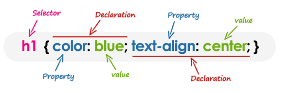

# week07

## 浏览器工作原理

### layout

* layout执行位置在endTag处（针对flex布局简化），实际startTag处就存layout计算了（正常流）
* flex 是一个CSS的display 属性中新添加一个值。 随着inline-flex的使用，它将使它适用的元素成为一个flex container（伸缩容器），而这个元素的每个子元素将成为 flex item（伸缩项目）。伸缩项目将参与到flex布局中，所有由CSS Flexible Box Layout Module（CSS伸缩盒布局模型）定义的属性都能被它们使用。(mdn)
* flex container
    flex-direction
        row
        row-reverse
        column
        column-reverse
    flex-wrap
* 收集元素: flex item
* 主轴和交叉轴区分，主要要理解flex的属性对应的布局情况

### render

* 引入images库
* 设置一个viewport，根据viewport和dom（排版好后的dom树）生成一张图片

### Tips

* 实际浏览器中，文字绘制需要依赖字体库

## 重学CSS

### css语法研究

css2.1的语法:
Grammer css产生式

#### 简单版本总体结构

    @charset
    @import
    rules
        @media
        @page
        rule

#### at-rules

    @charset
    @import
    @media
    @page
    @counter-style
    @keyframes
    @fontface
    @supports
    @namespace

#### rules

    selector
    Declaration
        key
            property
            variables
        value

### 兼容性

[手机淘宝的flexible设计与实现](http://www.html-js.com/article/2402)

### Tips

* 块格式化上下文（Block Formatting Context，BFC） 是Web页面的可视CSS渲染的一部分，是块盒子的布局过程发生的区域，也是浮动元素与其他元素交互的区域。([BFC](https://developer.mozilla.org/zh-CN/docs/Web/Guide/CSS/Block_formatting_context))
